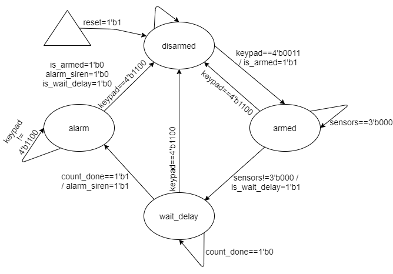
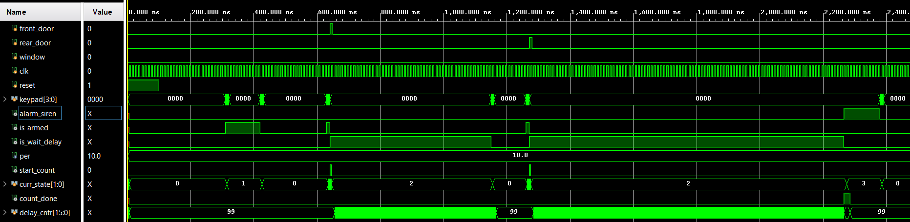

# security_alarm
This repository implements security alarm using Mealy machine.

Block diagram and state diagram for security system with Mealy FSM.

          |-------------------|
          |       alarm       |
     -->keypad           alarm_siren-->
     -->front_door            |
     -->rear_door         is_armed-->
     -->window                |
          |                   |
     -->reset                 |
     --> clk            is_wait_delay-->
          |                   |
          |-------------------|

  
The signals above can be described as follows:
* keypad[3:0] - 4-bit input used to `arm (0011)` or `disarm(1100)` the security system.
* front_door, rear_door, window - Single-bit inputs which are assumed to go high when security is breached and the alarm should be activated.
* sensors[2:0] - 3-bit internal signal formed by concatenating the inputs - front_door, rear_door, window. If any of the 3 bits in this signal goes high, the alarm would be triggered after a delay of 100 clock cycles
* clk - Master clock signal.
* reset - System reset.
* alarm_siren - Output which indicates that the system is in `alarm` state
* is_armed - Output which indicates that the system is in `armed` state
* is_wait_delay - Output which indicates that the system is in `wait_delay` state (a security breach has been detected and the system is waiting for 100 clock cycles before activating the alarm).
* start_count - Internal signal for counting 100 clock cycles before triggering the alarm.
* count_done - Internal signal that activates the alarm after 100 clock cycles have been counted.

Here's the simulation result for the given `alarm.v` tested using `alarm_tb.v`.

